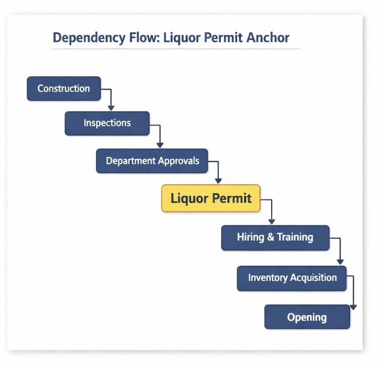

# Program Management & Launch Orchestration Architecture  
EMG Management | Founder-Operator | Reno, NV

---

## Executive Overview

This case study documents the structured program architecture used to remodel and launch a self-funded operating asset under regulatory dependency and capital constraint.

Execution was not linear.

It was governed by:

- Gantt-based dependency mapping  
- Liquor permit as critical path anchor  
- Activation gate discipline  
- Adaptive sequencing under delay  
- 30-day compressed operational sprint upon clearance  

This project demonstrates program governance under capital exposure.

---

## Program Architecture

The remodel and launch followed a gated orchestration model rather than a simple construction schedule.

Capital deployment, vendor coordination, inspections, and regulatory sequencing were layered deliberately to control risk exposure while maintaining structural readiness.

### What This Demonstrates

- Parallel execution of construction, compliance, and vendor coordination  
- Liquor permit positioned as the program’s transition milestone  
- Downstream streams gated behind regulatory certainty  
- Hiring and activation intentionally delayed to preserve liquidity  

**Deep dive:**  
[Program Timeline (Gantt Structure)](timeline_architecture/gantt_structure.md) ·  
[Workstream Layering](dependency_mapping/workstream_layers.md)

---

## Critical Path Governance

The liquor permit functioned as the program’s critical path anchor.

Revenue activation was impossible without its issuance.

The permit was not a single approval—it required cascading validation across multiple municipal departments.

### Governance Characteristics

- Construction completion fed inspection readiness  
- Inspections triggered departmental sign-offs  
- All agency approvals converged into final liquor license issuance  
- Failure at any stage reset approval cadence  

Downstream effects of delay:

- Hiring could not activate  
- Inventory could not be purchased  
- Payroll ramp remained frozen  
- Capital burn continued without revenue  

**Deep dive:**  
[Critical Path Anchor](critical_path/liquor_permit_anchor.md) ·  
[Dependency Mapping](dependency_mapping/dependency_diagram.md)

---

## Gate-Based Activation Framework

Once liquor permit approval was granted, the program transitioned from compliance mode to controlled activation.

All downstream streams were mobilized within a compressed 30-day sprint.

### Gate Progression

**Gate 1 – Regulatory Clearance**
- All departmental sign-offs complete  
- Liquor license formally issued  

**Gate 2 – Infrastructure Activation**
- POS fully configured and tested  
- Inventory loaded and reconciled  
- Vendor contracts operational  

**Gate 3 – Workforce Deployment**
- Hiring sprint initiated  
- Staff trained across systems (POS, inventory, scheduling, payroll, CRM)  
- Operational theme and service standards enforced  

**Gate 4 – Revenue Stabilization**
- Opening executed  
- KPI validation achieved  
- Labor-to-sales calibration reviewed  

The activation sprint required system fluency and cultural alignment under time compression.

**Deep dive:**  
[Milestone Gates](timeline_architecture/milestone_gates.md) ·  
[30-Day Activation Sprint](activation_sprint/30_day_compression_model.md)

---

## Adaptive Gate Control Under Delay

The original timeline did not anticipate extended regulatory delay.

When liquor permit issuance slipped beyond the projected opening date:

- Downstream hiring was frozen  
- Inventory acquisition was paused  
- Payroll ramp was deferred  
- Vendor sequencing was staggered  
- Timeline adjusted in Gantt model  

The program shifted from forward momentum to capital preservation mode.

This prevented compounding burn under uncertainty.

**Deep dive:**  
[Adaptive Gate Control](risk_adaptation/adaptive_gate_control.md) ·  
[Program Risk Register](risk_adaptation/risk_register.md)

---

## Capital Risk Context

Total capital deployed included:

- ~$300,000 remodel  
- ~$12,000 permits  
- ~$3,000 materials  
- $3,800 monthly rent  
- $2,500 sound & lighting lease  
- $1,200 POS lease  
- $1,100 insurance  
- $3,000/month marketing agency  
- Utilities + owner burn  

Projected opening: March 15  
Actual opening: September 28  

The program architecture above reflects how regulatory delay was absorbed and restructured rather than reacted to chaotically.

---

## Strategic Outcome

- 30-day activation sprint following permit issuance  
- ~$70K opening week revenue  
- $30K weekly stabilization target achieved immediately  
- Structured governance loop active at launch  

This project demonstrates:

- Dependency-aware program management  
- Critical path anchoring  
- Adaptive re-sequencing under regulatory delay  
- Capital-sensitive gating discipline  
- Compressed operational mobilization  

The liquor permit was not a task.

It was the program anchor.
